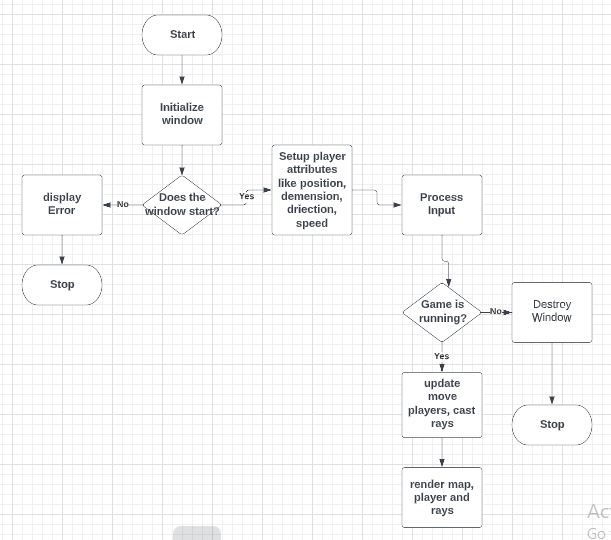
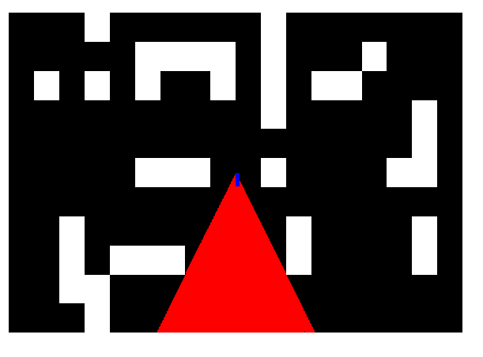

<html>
 <body>
  <h1>Maze</h1>
  <header>
   <ul>
    <li><a href="#intro"/>Introduction</a></li>
    <li><a href="#feature"/>Feature</a></li>
    <li><a href="#about"/>About</a></li>
    
   <button type="submit"><a href="https://github.com/khanmamia/Maze">Project</a></button>
  </ul>
  
  </header>
 
   
<h2 class="intro">Introduction</h2>

The main goal for this project is  to make a fully functioning game using a third party SDL library in 3D using raycasting that would challenge the player to think outside of the box and move in a different direction.

Another goal included adding enemies(e.g. obstacle ) to make the game interesting and using weapons . Finally, the constraint for time was an issue because the project took a lot of time..

  <h2>Directory layout</h2>
  <h3>Typical layout:</h3>

Maze/            project folder
   
|--headers/     headers folder
     
|-- src/         src folder
     
|-- image/       image folder
     
| --Makefile     makefile
     
  <h2 class="feature">Feature</h2> 
  
  
  
  

  <h2 class="about">About</h2> 
So why did I choose such a project? The purpose of this project for me is firstly,
  <ul>
<li> to learn the mathematics and physics behind developing the game and learn computer graphics concepts like how to render</li>
<li> to learn how to develop a game without a game engine, without using the best free game engine like Unity or Unreal.</li>
<li>finally, it is Alx portfolio project.</li>
  </ul>
  <h3>Arafat Mamia</h3>
   
github:-https://github.com/khanmamia/
   
github project:- https://github.com/khanmamia/Maze
   
linkedin:-https://www.linkedin.com/in/arafat-mamia-74a93a202/
   
  <body/>
</html>

